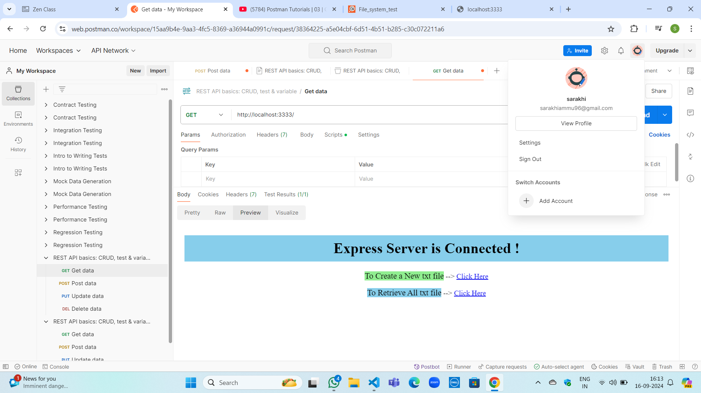
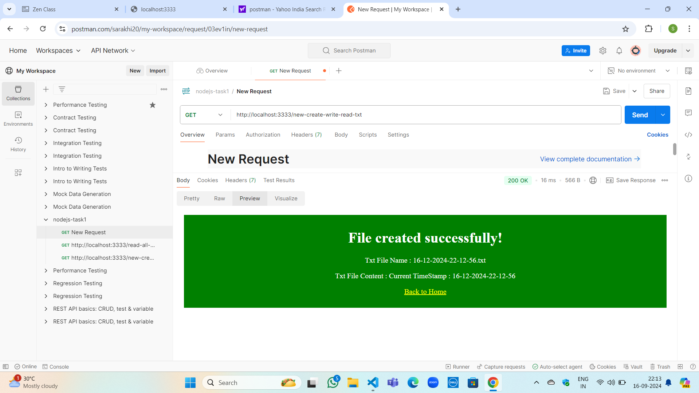
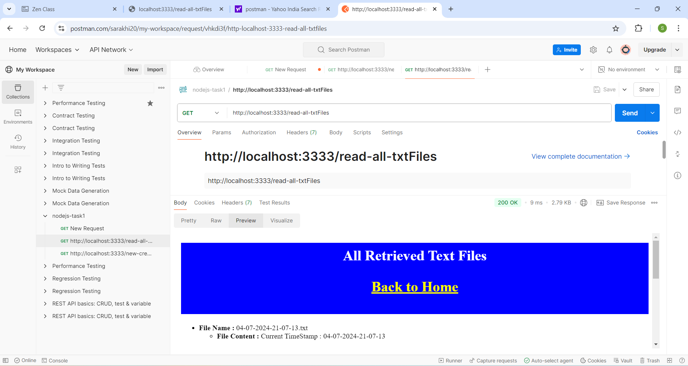

# NodeJS-FileSystem-Task

It's my first Backend Server/API task which was designed using node and express. It's Guvi-Zen class Roadmap session: Day-37 and Nodejs- Day -1 Task.

## Tech Stack

- fs
- NodeJs
- ExpressJS
- Nodemon
- date-fns
- postman

## Features

- Create new txt file and view all created txt files by just giving the API endpoints

## Lessons Learned

Through this task I learned to create express server and API endpoints. And also, I learned to use postman-API Testing Tool

## Testing Tool

I used Postman to test my api endpoints are working fine.

## Website

[click-task1](https://nodejs-task1-d89w.onrender.com)

## API Documentation

[Click here to view API Documentation](https://www.postman.com/sarakhi20/my-workspace/collection/ioc7t41/nodejs-task1?action=share&creator=38364225)

## Screenshots

##  Clone the repository

- GitHub---[link](https://github.com/sarakhi20/nodejs-task1.git)
## Setup

Followig are the requirements to run this project:
- Node-Js
- Node Package Manager (NPM)

## npm run dev
- http://localhost:3333/
